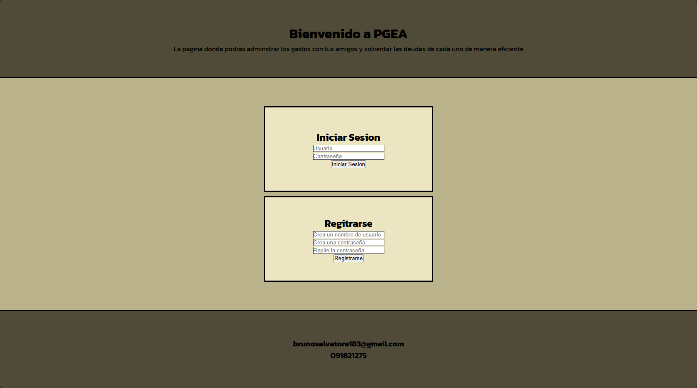
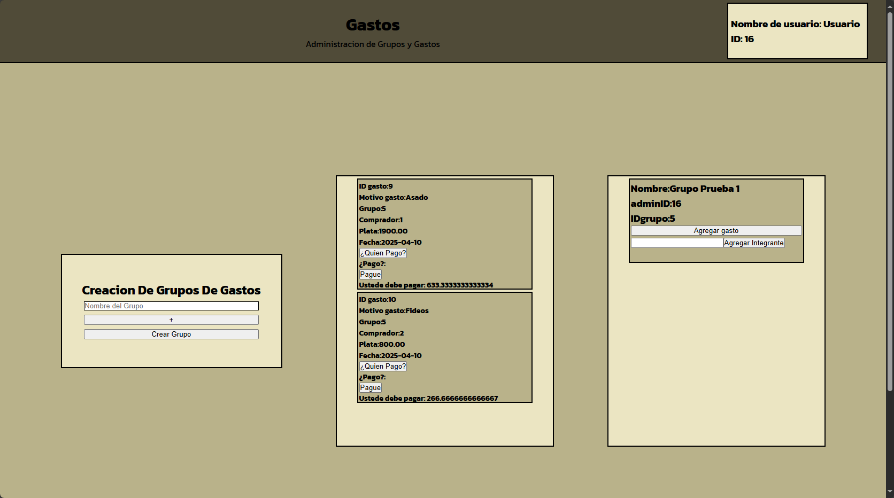

# PGEA(Pagina de Gastos Entre Amigos)

Gastos Entre Amigos es una aplicación web pensada para resolver uno de los problemas más comunes cuando salís con tus amigos: dividir los gastos de forma justa y sin discusiones.

Imaginate esto: vas al super con tus amigos, hacen una compra grupal (comida, bebidas, lo que pinte), 
y después llega el momento incómodo de dividir quién debe cuánto. 
Muchas veces uno termina poniendo más plata, otro se olvida de pagar, o simplemente se pierde el control de los números.
Esta página te permite organizar y registrar todos esos gastos compartidos de forma clara y transparente.

## 🛰️ Con esta app podés:

#Crear un grupo con tus amigos ✅

#Registrar los gastos que hace cada uno ✅

#Ver cuánto debe cada integrante ✅

#Marcar quién ya pagó su parte ✅
 
#Llevar el control de todos los pagos y deudas ✅

Ideal para:

#Compras grupales en el super ✅

#Viajes con amigos ✅

#Fiestas y eventos ✅

#Cualquier situación donde haya que dividir la cuenta 💸

Este proyecto busca hacer más fácil y justa la administración de gastos entre personas, usando una interfaz sencilla y funcionalidades prácticas que se adaptan a cualquier grupo.

## 🚀 Tecnologías utilizadas

- Node.js
- Express
- MySQL
- JavaScript
- HTML/CSS

## 🛠️ Instalación

1. Cloná el repositorio:

```bash
git clone https://github.com/tuusuario/nombre-repo.git
```

2.Instala las dependencias

```bash
npm install
```

3.Configurá tu base de datos (usá .env si tenés)

```bash
npm start
```

## 📸 Screenshots





## 📁 Estructura del proyecto

```bash
/back
  └── app.js

/public
  └── main/
      ├── app.js
      ├── check.png
      ├── index.html
      └── style.css
  ├── app.js
  ├── index.html
  └── style.css

/src/img/
.gitignore
base.sql
package.json
package-lock.json
README.md
script.js
```


